  

  

> *"Önce ölç, sonra 'bitti' de."* — atölyenin tek kuralı.

## ⚙️ Zırh modülleri · Workstation Projects → [kabaforce.com](https://kabaforce.com)

Her modül sıfırdan, atölyede yazıldı. İkinci el parça yok.

<table>
  <tr>
    <td></td>
    <td></td>
  </tr>
  <tr>
    <td></td>
    <td></td>
  </tr>
</table>

## 🛡️ Savunma sistemleri

  

## 🔧 MK-0 · Her şey bir mağarada, bir kutu hurdayla başladı

İlk prototipler. Küçük, dürüst, çoğu bugün hâlâ çalışıyor.

| Prototip | Ne yapar |
|---|---|
| [depremtakibi](https://github.com/mrsemihkaba/depremtakibi) | AFAD'dan anlık deprem verilerini çekip son depremleri listeler. |
| [SocketKontrol](https://github.com/mrsemihkaba/SocketKontrol) | Bir adresin IP'lerini bulur, belirtilen portta soket kontrolü yapar. |
| [github_proje_indirici](https://github.com/mrsemihkaba/github_proje_indirici) | Bir kullanıcının GitHub projelerini listeleyip seçileni indirir. |
| [sezar_sifreleme](https://github.com/mrsemihkaba/sezar_sifreleme) | Sezar şifrelemesiyle metin şifreler ve çözer. |
| [parola_olusturucu](https://github.com/mrsemihkaba/parola_olusturucu) | İstenen uzunlukta rastgele parola üretir. |
| [ConsoleProjeleri](https://github.com/mrsemihkaba/ConsoleProjeleri) | C# ile 50 konsol projesi — sabrın kanıtı. |
| [ubuntu](https://github.com/mrsemihkaba/ubuntu) | Ubuntu ile temel Linux eğitim serisi. |

## 📡 Atölyeye bağlan

Ciddi bir problemin, cesur bir fikrin ya da sadece merakın varsa — sinyal açık.

  
  

<code>// sistem kapanmaz, yalnız bir sonraki sürüme geçer.</code>

